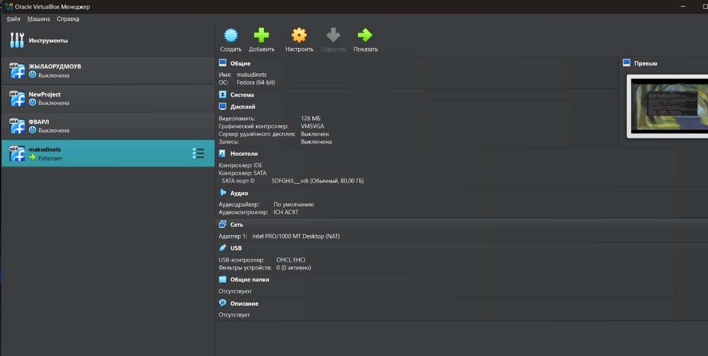
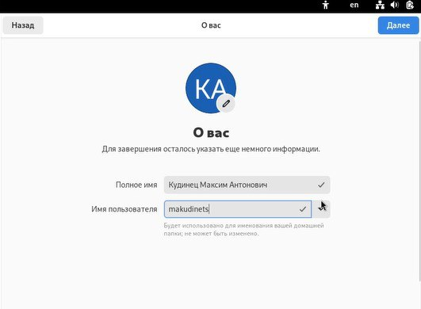
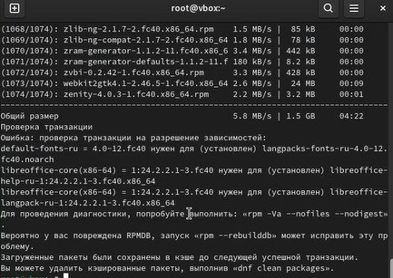
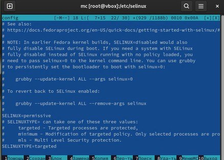
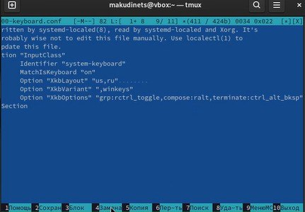
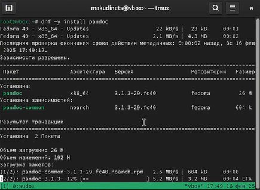
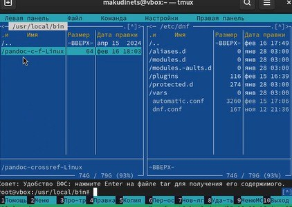
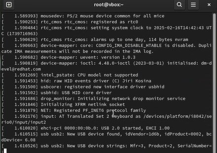
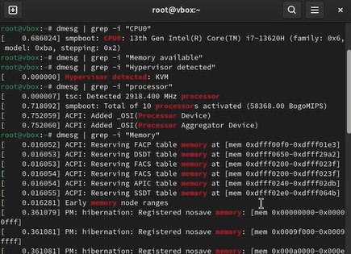

---
## Front matter
title: "Отчёт по лабораторной работе №1"
subtitle: "Специальность: архитектура компьютеров"
author: "Кудинец Максим Антонович"

## Generic otions
lang: ru-RU
toc-title: "Содержание"

## Bibliography
bibliography: bib/cite.bib
csl: pandoc/csl/gost-r-7-0-5-2008-numeric.csl

## Pdf output format
toc: true # Table of contents
toc-depth: 2
lof: true # List of figures
lot: true # List of tables
fontsize: 12pt
linestretch: 1.5
papersize: a4
documentclass: scrreprt
## I18n polyglossia
polyglossia-lang:
  name: russian
  options:
	- spelling=modern
	- babelshorthands=true
polyglossia-otherlangs:
  name: english
## I18n babel
babel-lang: russian
babel-otherlangs: english
## Fonts
mainfont: IBM Plex Serif
romanfont: IBM Plex Serif
sansfont: IBM Plex Sans
monofont: IBM Plex Mono
mathfont: STIX Two Math
mainfontoptions: Ligatures=Common,Ligatures=TeX,Scale=0.94
romanfontoptions: Ligatures=Common,Ligatures=TeX,Scale=0.94
sansfontoptions: Ligatures=Common,Ligatures=TeX,Scale=MatchLowercase,Scale=0.94
monofontoptions: Scale=MatchLowercase,Scale=0.94,FakeStretch=0.9
mathfontoptions:
## Biblatex
biblatex: true
biblio-style: "gost-numeric"
biblatexoptions:
  - parentracker=true
  - backend=biber
  - hyperref=auto
  - language=auto
  - autolang=other*
  - citestyle=gost-numeric
## Pandoc-crossref LaTeX customization
figureTitle: "Рис."
tableTitle: "Таблица"
listingTitle: "Листинг"
lofTitle: "Список иллюстраций"
lotTitle: "Список таблиц"
lolTitle: "Листинги"
## Misc options
indent: true
header-includes:
  - \usepackage{indentfirst}
  - \usepackage{float} # keep figures where there are in the text
  - \floatplacement{figure}{H} # keep figures where there are in the text
---

# Цель работы

Целью данной работы является приобретение практических навыков установки операционной системы на виртуальную машину, настройки минимально необходимых для дальнейшей работы сервисов.

# Задание

1) Запуск VirtualBox и создание новой виртуальной машины (операционная система Linux, Fedora). 
2) Настройка установки ОС. 
3)Перезапуск виртуальной машины и установка драйверов для VirtualBox. 
4)Подключение образа диска дополнений гостевой ОС. 
5)Установка необходимого ПО для создания документации. 
6)Выполнение домашнего задания.

# Теоретическое введение

Операционная система - это комплекс взаимосвязанных программ, который действует как интерфейс между приложениями и пользователями с одной стороны и аппаратурой компьютера с другой стороны. VirtualBox - это специальное средство для виртуализации, позволяющее запускать операционную систему внутри другой. С помощью VirtualBox мы можем также настраивать сеть, обмениваться файлами и делать многое другое

# Выполнение лабораторной работы

## Создание виртуальной машины

1. Создадим новую виртуальную машину, указав имя, размер основной памяти, размер видеопамяти, размер диска и других параметров на свое усмотрение, выбираем образ системы Fedora. (рис. [-@fig:001])

{#fig:001 width=70%}

2. Начнем установку операционной системы, внеся перед этим необходимые для этого данные. (рис. [-@fig:002])

{#fig:002 width=70%}

## После установки

### Обновления

3. Войдем в ОС под своей учетной записью. В терминале через роль суперпользователя производим установку обновлений. (рис. [-@fig:003])

{#fig:003 width=70%}

### Повышение удобства работы. Отключение SELinux

4. Установим программу tmux. (рис. [-@fig:004]) Запустим ее, затем через команду mc в терминале заходим в требуемый файл и отключаем SELinux, заменив в файле значение enforcing на permissive. Перезапустим виртуальную машину.

{#fig:004 width=70%}

### Настройка раскладки клавиатуры

5. Создадим конфиг файл. (рис. [-@fig:005])

{#fig:005 width=70%}

6. Отредактируем этот файл, подбирая значения под себя. Затем отредактируем еще один файл (/etc/X11/xorg.conf.d/00keyboard.conf) и перезагрузим машину. (рис. [-@fig:006]) (рис. [-@fig:007])

{#fig:006 width=70%}

{#fig:007 width=70%}

### Автоматическое обновление.

7. Устанавливаем ПО для автообновления. Снова редактируем конфигурационный файл, запускаем таймер.

## Установка программного обеспечения для создания документации

8. Скачаем pandoc и pandoc-crossref из репозитория Гитхаб. (рис. [-@fig:008])

{#fig:008 width=70%}

9. Перенесем необходимые файлы в необходимый каталог. (рис. [-@fig:009])

{#fig:009 width=70%}

10. Установим дистрибутив TexLive. (рис. [-@fig:010])

{#fig:010 width=70%}

## Домашнее задание

11. Посмотрим порядок загрузки системы с помощью команды dmesg, (рис. [-@fig:011]) получим необходимую информацию. (рис. [-@fig:012])

{#fig:011 width=70%}

{#fig:012 width=70%}

# Контрольные вопросы

1) Какую информацию содержит учетная запись пользователя? 
Имя пользователя, зашифрованный пароль пользователя, индентификационный номер пользователя, индентификационный номер группы пользователя, домашний каталог пользователя, командный интерпретатор пользователя.

2) Укажите команды терминала и приведите примеры: -для получения справки по команде: man man cd -ддя перемещения по файловой системе: cd cd ~/Downloads - для просмотра содержимого каталога: ls ls ~ Downloads - для определения объема каталога: du du Downloads -для создания каталогов: mkdir mkdir ~ Downloads/New - для создания файлов: touch touch retouch - для удаления каталогов: rm rm dir1 - для удаления файлов: rm -r rm -r text.txt - для задания определенных прав на файл или каталог: chmod + x chmod +x text.txt -для просмотра истории команд: history

3) Что такое файловая система? Приведите примеры с краткой характеристикой.
Файловая система - это часть операционной системы, назначение которой состоит в том, чтобы обеспечить пользователю удобный интерфейс при работе с данными, хранящимися на диске, и обеспечить совместное использование файлов несколькими пользователями и процессорами. Примеры файловых систем: Ext2, Ext3, Ext4 или Extended Felisystem - стандартная файловая система для Linux. NTFS (New Technology File System): Стандартная файловая система для Windows.

4) Как посмотреть, какие файловые системы подмонтированы в ОС?
Команда mount

5) Как удалить зависший процесс?
Команда kill

# Выводы

В результате выполнения лабораторной работы мы приобрели навыки установки операционной системы на виртуальную машину, а также настройки минимально необходимых для дальнейшей работы сервисов.

# Список литературы{.unnumbered}

::: {#refs}
:::
