---
## Front matter
title: "Отчёт по лабораторной работе №4"
subtitle: "Специальность: архитектура компьютеров"
author: "Кудинец Максим Антонович"

## Generic otions
lang: ru-RU
toc-title: "Содержание"

## Bibliography
bibliography: bib/cite.bib
csl: pandoc/csl/gost-r-7-0-5-2008-numeric.csl

## Pdf output format
toc: true # Table of contents
toc-depth: 2
lof: true # List of figures
lot: true # List of tables
fontsize: 12pt
linestretch: 1.5
papersize: a4
documentclass: scrreprt
## I18n polyglossia
polyglossia-lang:
  name: russian
  options:
	- spelling=modern
	- babelshorthands=true
polyglossia-otherlangs:
  name: english
## I18n babel
babel-lang: russian
babel-otherlangs: english
## Fonts
mainfont: IBM Plex Serif
romanfont: IBM Plex Serif
sansfont: IBM Plex Sans
monofont: IBM Plex Mono
mathfont: STIX Two Math
mainfontoptions: Ligatures=Common,Ligatures=TeX,Scale=0.94
romanfontoptions: Ligatures=Common,Ligatures=TeX,Scale=0.94
sansfontoptions: Ligatures=Common,Ligatures=TeX,Scale=MatchLowercase,Scale=0.94
monofontoptions: Scale=MatchLowercase,Scale=0.94,FakeStretch=0.9
mathfontoptions:
## Biblatex
biblatex: true
biblio-style: "gost-numeric"
biblatexoptions:
  - parentracker=true
  - backend=biber
  - hyperref=auto
  - language=auto
  - autolang=other*
  - citestyle=gost-numeric
## Pandoc-crossref LaTeX customization
figureTitle: "Рис."
tableTitle: "Таблица"
listingTitle: "Листинг"
lofTitle: "Список иллюстраций"
lotTitle: "Список таблиц"
lolTitle: "Листинги"
## Misc options
indent: true
header-includes:
  - \usepackage{indentfirst}
  - \usepackage{float} # keep figures where there are in the text
  - \floatplacement{figure}{H} # keep figures where there are in the text
---

# Цель работы

Получение навыков правильной работы с репозиториями git.

# Задание

1. Выполнить работу для тестового репозитория.
2. Преобразовать рабочий репозиторий в репозиторий с git-flow и conventional commits.

# Теоретическое введение

## Рабочий процесс Gitflow

Рабочий процесс Gitflow Workflow. Будем описывать его с использованием пакета git-flow.
Общая информация
Gitflow Workflow опубликована и популяризована Винсентом Дриссеном.
Gitflow Workflow предполагает выстраивание строгой модели ветвления с учётом выпуска проекта.
Данная модель отлично подходит для организации рабочего процесса на основе релизов.
Работа по модели Gitflow включает создание отдельной ветки для исправлений ошибок в рабочей среде.
Последовательность действий при работе по модели Gitflow:
Из ветки master создаётся ветка develop.
Из ветки develop создаётся ветка release.
Из ветки develop создаются ветки feature.
Когда работа над веткой feature завершена, она сливается с веткой develop.
Когда работа над веткой релиза release завершена, она сливается в ветки develop и master.
Если в master обнаружена проблема, из master создаётся ветка hotfix.
Когда работа над веткой исправления hotfix завершена, она сливается в ветки develop и master.

# Выполнение лабораторной работы

## Установка программного обеспечения.

### Установка git-flow

1. Открываем терминал и входим в режим суперпользователя, устанавливаем gitflow. (рис. [-@fig:001]).

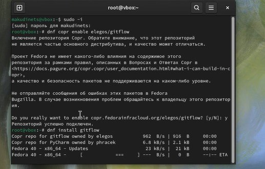{#fig:001 width=70%}

### Установка и настройка node.js

2. Устанавливаем pnpm и nodejs. (рис. [-@fig:002]).

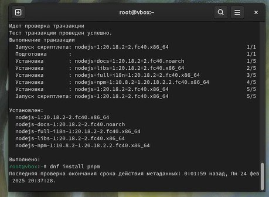{#fig:002 width=70%}

3. Настраиваем nodejs. (рис. [-@fig:003]).

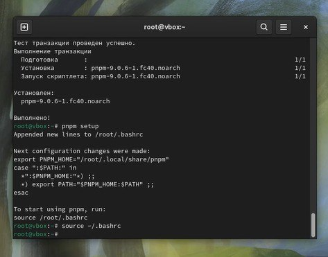{#fig:003 width=70%}

### Общепринятые коммиты.

4. Настраиваем commitizen и standard-changelog (рис. [-@fig:004]).

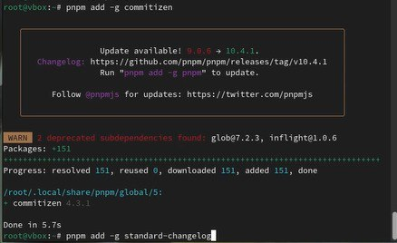{#fig:004 width=70%}

## Практический сценарий использования git. 

### Создание репозитория git.

5. Создаем репозиторий git, настраиваем его и делаем в него первый коммит. (рис. [-@fig:005]).

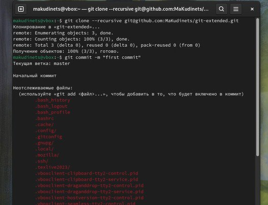{#fig:005 width=70%}

6. Настраиваем пакет файлов nodejs (рис. [-@fig:006]). В файле package.json меняем необходимые данные. (рис. [-@fig:007]).

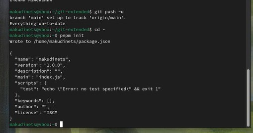{#fig:006 width=70%}

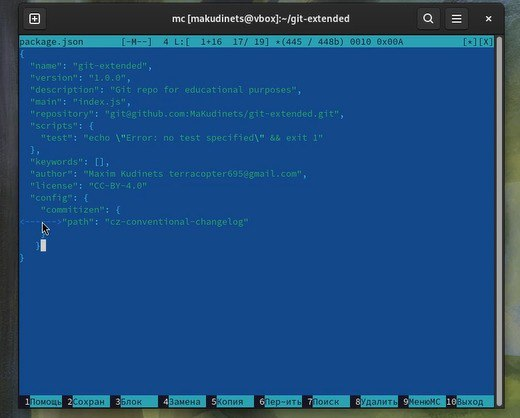{#fig:007 width=70%}

7. Выполняем коммит (рис. [-@fig:008]). Выкладываем на github. (рис. [-@fig:009]). 

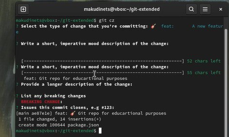{#fig:008 width=70%}

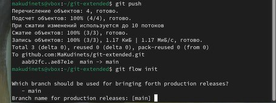{#fig:009 width=70%}

8. Инициализируем gitflow, проверяем, на какой ветке мы находимся в данный момент, после чего загружаем весь репозиторий в хранилище. (рис. [-@fig:010]).

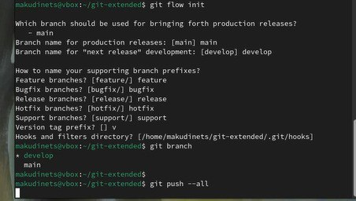{#fig:010 width=70%}

9. Устанавливаем внешнюю ветку как вышестоящую для этой ветки (рис. [-@fig:011]). Создаем релиз с версией 1.0.0 и журнал изменений. (рис. [-@fig:012]).

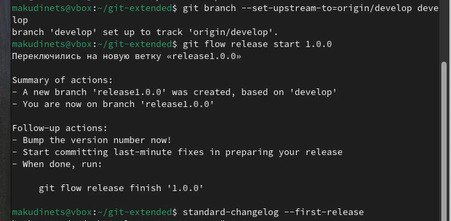{#fig:011 width=70%}

{#fig:012 width=70%}

10. Заливаем релизную ветку в основную, добавляем журнал изменений в индекс, после чего заливаем релизную ветку в основную. (рис. [-@fig:013]).

{#fig:013 width=70%}

11. Отправляем данные и теги на гитхаб. (рис. [-@fig:014]).

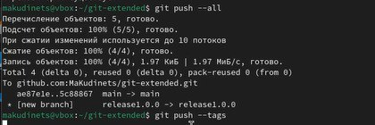{#fig:014 width=70%}

### Работа с репозиторием git.

12. Создаем релиз на гитхабе. Создаем ветку для новой функциональности. (рис. [-@fig:015]).

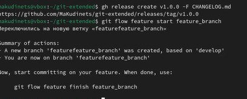{#fig:015 width=70%}

13. Объединяем новую ветку с develop. Создаём релиз с версией 1.2.3. (рис. [-@fig:016]).

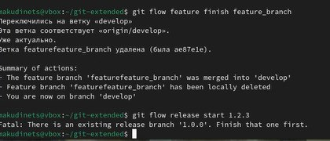{#fig:016 width=70%}

14. Изменяем номер версии в файле package.json. (рис. [-@fig:017]).

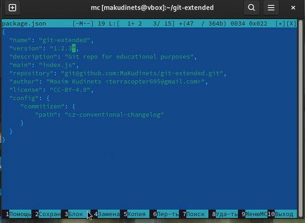{#fig:017 width=70%}

15. Заливаем релизную ветку в основную (рис. [-@fig:018]). Отправляем данные на гитхаб. (рис. [-@fig:019]).

{#fig:018 width=70%}

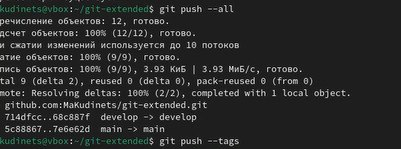{#fig:019 width=70%}

16. Создаём релиз на гитхабе с комментарием из журнала изменений. (рис. [-@fig:020]).

{#fig:020 width=70%}

# Выводы

В процессе выполнения лабораторной работы я приобрел навыки правильной работы с репозиториями git.

# Список литературы{.unnumbered}

::: {#refs}
:::
