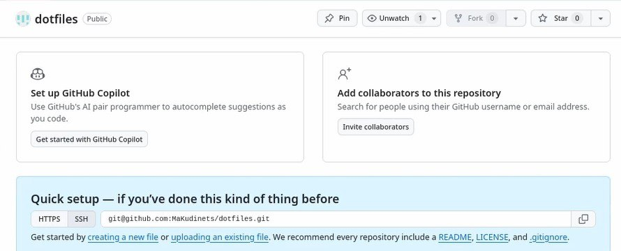
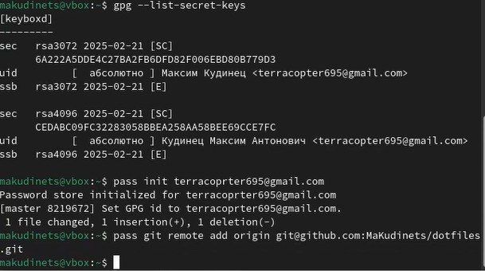
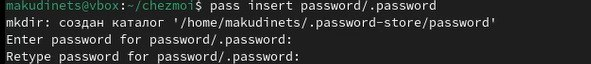
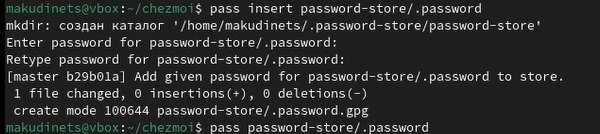
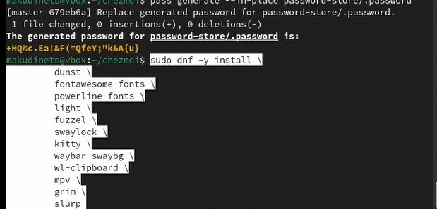
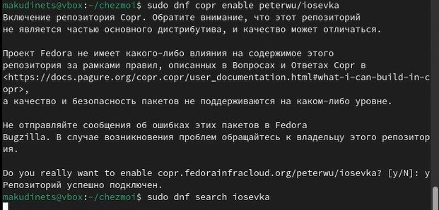
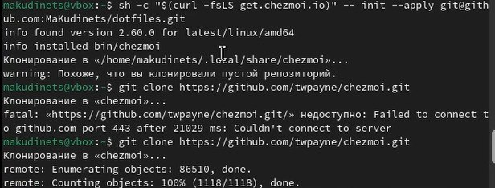
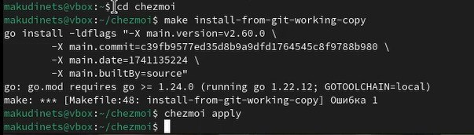
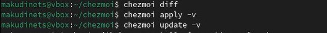
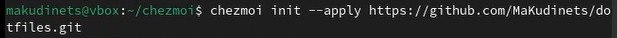

---
## Front matter
lang: ru-RU
title: Отчёт по пятой лабораторной работе
subtitle: Операционные системы
author:
  - Кудинец М. А.
institute:
  - Российский университет дружбы народов, Москва, Россия

## i18n babel
babel-lang: russian
babel-otherlangs: english

## Formatting pdf
toc: false
toc-title: Содержание
slide_level: 2
aspectratio: 169
section-titles: true
theme: metropolis
header-includes:
 - \metroset{progressbar=frametitle,sectionpage=progressbar,numbering=fraction}
---

# Информация

## Докладчик

:::::::::::::: {.columns align=center}
::: {.column width="70%"}

 * Кудинец Максим Антонович
  * НКАбд-02-2024 № Студенческого билета: 1132246729
  * Российский университет дружбы народов
  * <https://github.com/MaKudinets/study_2024-2025_os-intro>

:::
::::::::::::::

# Цель работы

Установить, настроить и научиться пользоваться основными возможностями менеджера паролей

# Задание

1. Установка и настройка менеджера паролей
2. Управление файлами конфигурации
3. Установка дополнительного программного обеспечения

# Выполнение лабораторной работы

1. Создание репозитория для хранения паролей и использования основных команд.

{#fig:001 width=70%}

##

2. Установка и инициализация программы pass.

{#fig:009 width=70%}

##

3. Создание нового каталога, загрузка в него пароля, генерация нового пароля и установка дополнительного программного обеспечения. и шрифтов.

{#fig:007 width=70%}

##

{#fig:005 width=70%}

##

{#fig:006 width=70%}

##

{#fig:002 width=70%}

##

4. Установка бинарного файла, клонирование шаблонного репозитория.

{#fig:004 width=70%}

##

5. Настройка chezmoi, проверка изменений, установка своих dotfiles на новый компьютер.

{#fig:003 width=70%}

##

{#fig:008 width=70%}

##

{#fig:010 width=70%}

# Выводы

Разобрался с работой менеджера паролей и научился пользоваться основными его командами

:::

