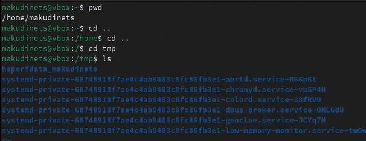
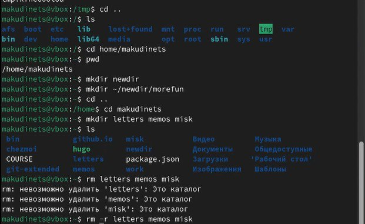
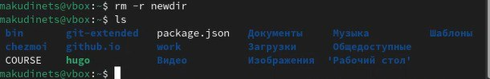
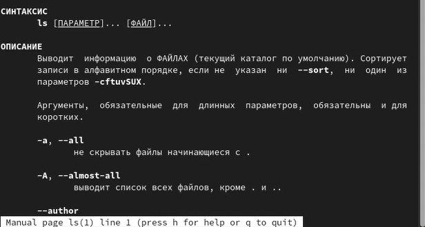
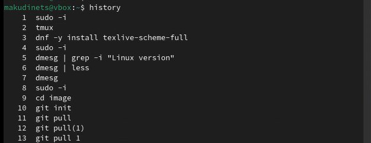

---
## Front matter
lang: ru-RU
title: Отчёт по шестой лабораторной работе
subtitle: Операционные системы
author:
  - Кудинец М. А.
institute:
  - Российский университет дружбы народов, Москва, Россия
## i18n babel
babel-lang: russian
babel-otherlangs: english

## Formatting pdf
toc: false
toc-title: Содержание
slide_level: 2
aspectratio: 169
section-titles: true
theme: metropolis
header-includes:
 - \metroset{progressbar=frametitle,sectionpage=progressbar,numbering=fraction}
---

# Информация

## Докладчик

:::::::::::::: {.columns align=center}
::: {.column width="70%"}

 * Кудинец Максим Антонович
  * НКАбд-02-2024 № Студенческого билета: 1132246729
  * Российский университет дружбы народов
  * <https://github.com/MaKudinets/study_2024-2025_os-intro>

:::
::: {.column width="30%"}

:::
::::::::::::::

# Цель работы

Приобретение практических навыков взаимодействия пользователя с системой по-
средством командной строки.

# Задачи

1. Разобраться с принципом работы команд cd, mkdir, rm, man и history

# Выполнение лабораторной работы

1. Узнаю полное название своего домашнего каталога. Перехожу в каталог tmp и вывожу на экран его содержимое. 

{#fig:001 width=70%}

##

2. Выполняю действия с каталогами, такие как создание, переход и рекурсивное удаление 

{#fig:002 width=70%}

##

{#fig:003 width=70%}

##

3. Разбираюсь со способами использования команды man

{#fig:004 width=70%}

##

4. Команда history

{#fig:005 width=70%}

##

# Выводы

Приобретение практических навыков взаимодействия пользователя с системой по-
средством командной строки.

:::

