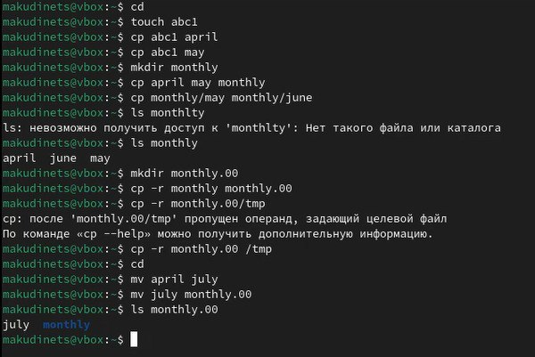
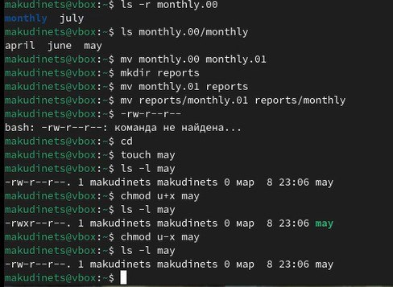
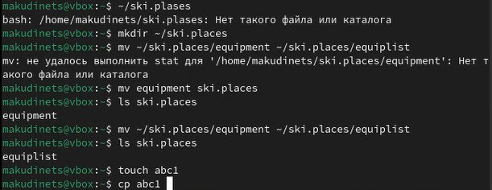
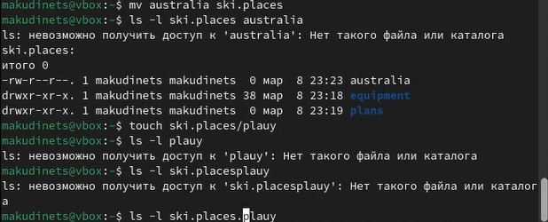
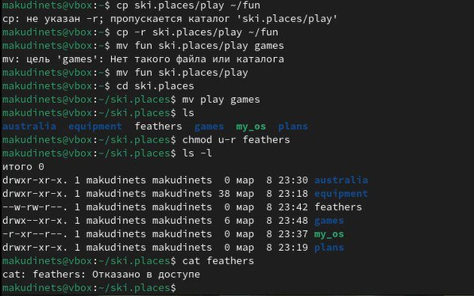
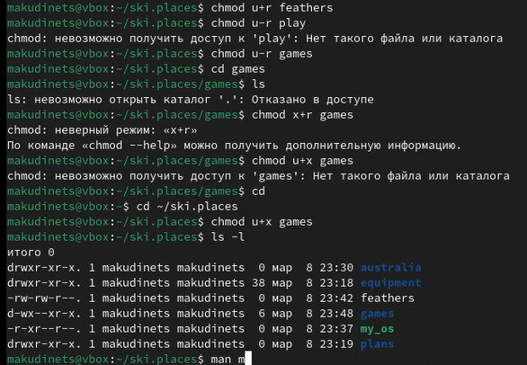

---
## Front matter
lang: ru-RU
title: Отчёт по седьмой лабораторной работе
subtitle: Операционные системы
author:
  - Кудинец М. А.
institute:
  - Российский университет дружбы народов, Москва, Россия
## i18n babel
babel-lang: russian
babel-otherlangs: english

## Formatting pdf
toc: false
toc-title: Содержание
slide_level: 2
aspectratio: 169
section-titles: true
theme: metropolis
header-includes:
 - \metroset{progressbar=frametitle,sectionpage=progressbar,numbering=fraction}
---

# Информация

## Докладчик

:::::::::::::: {.columns align=center}
::: {.column width="70%"}

 * Кудинец Максим Антонович
  * НКАбд-02-2024 № Студенческого билета: 1132246729
  * Российский университет дружбы народов
  * <https://github.com/MaKudinets/study_2024-2025_os-intro>

:::
::: {.column width="30%"}

:::
::::::::::::::

# Цель работы

Ознакомление с файловой системой Linux, её структурой, именами и содержанием
каталогов. Приобретение практических навыков по применению команд для работы
с файлами и каталогами, по управлению процессами (и работами), по проверке использования диска и обслуживанию файловой системы

# Задание

1. Разобраться с использованием команды mv, cat, cp, chmod

# Теоретическое введение

# Выполнение лабораторной работы

1. Создаем несколько файлов и переносим их в каталоги, из каталогов, копируем их и меняем их параметры

{#fig:001 width=70%}

##

{#fig:002 width=70%}

##

2. Создаем новый каталог и проводим с ним такие же манипуляции 

{#fig:003 width=70%} 

##

{#fig:004 width=70%}

##

3. Используем команду chmod и меняем параметры файлов

{#fig:005 width=70%}

##

{#fig:006 width=70%}

# Выводы

Ознакомился с файловой системой Linux, её структурой, именами и содержанием
каталогов. Приобрел практических навыков по применению команд для работы
с файлами и каталогами, по управлению процессами (и работами), по проверке использования диска и обслуживанию файловой системы

:::

