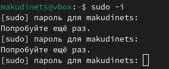

---
## Front matter
lang: ru-RU
title: Отчёт по восьмой лабораторной работе
subtitle: Операционные системы
author:
  - Кудинец М. А.
institute:
  - Российский университет дружбы народов, Москва, Россия

## i18n babel
babel-lang: russian
babel-otherlangs: english

## Formatting pdf
toc: false
toc-title: Содержание
slide_level: 2
aspectratio: 169
section-titles: true
theme: metropolis
header-includes:
 - \metroset{progressbar=frametitle,sectionpage=progressbar,numbering=fraction}
---

# Информация

## Докладчик

:::::::::::::: {.columns align=center}
::: {.column width="70%"}

 * Кудинец Максим Антонович
  * НКАбд-02-2024 № Студенческого билета: 1132246729
  * Российский университет дружбы народов
  * <https://github.com/MaKudinets/study_2024-2025_os-intro>

:::
::: {.column width="30%"}

:::
::::::::::::::

# Цель 

Ознакомление с инструментами поиска файлов и фильтрации текстовых данных.
Приобретение практических навыков: по управлению процессами (и заданиями), по
проверке использования диска и обслуживанию файловых систем.

# Задание

1. Осуществите вход в систему, используя соответствующее имя пользователя.
2. Запишите в файл file.txt названия файлов, содержащихся в каталоге /etc. Допи-
шите в этот же файл названия файлов, содержащихся в вашем домашнем каталоге.
3. Выведите имена всех файлов из file.txt, имеющих расширение .conf, после чего
запишите их в новый текстовой файл conf.txt.
4. Определите, какие файлы в вашем домашнем каталоге имеют имена, начинавшиеся
с символа c? Предложите несколько вариантов, как это сделать.
5. Выведите на экран (по странично) имена файлов из каталога /etc, начинающиеся
с символа h.
6. Запустите в фоновом режиме процесс, который будет записывать в файл ~/logfile
файлы, имена которых начинаются с log.
7. Удалите файл ~/logfile.
8. Запустите из консоли в фоновом режиме редактор gedit.
9. Определите идентификатор процесса gedit, используя команду ps, конвейер и фильтр
grep. Как ещё можно определить идентификатор процесса?
10. Прочтите справку (man) команды kill, после чего используйте её для завершения
процесса gedit.
11. Выполните команды df и du, предварительно получив более подробную информацию
об этих командах, с помощью команды man.
12. Воспользовавшись справкой команды find, выведите имена всех директорий, имею-
щихся в вашем домашнем каталоге.

# Теоретическое введение

В системе по умолчанию открыто три специальных потока:
– stdin — стандартный поток ввода (по умолчанию: клавиатура), файловый дескриптор
0;
– stdout — стандартный поток вывода (по умолчанию: консоль), файловый дескриптор
1;
– stderr — стандартный поток вывод сообщений об ошибках (по умолчанию: консоль),
файловый дескриптор 2.
Большинство используемых в консоли команд и программ записывают результаты
своей работы в стандартный поток вывода stdout. Например, команда ls выводит в стан-
дартный поток вывода (консоль) список файлов в текущей директории. Потоки вывода
и ввода можно перенаправлять на другие файлы или устройства. Проще всего это делается
с помощью символов >, >>, <, <<.
Конвейер (pipe) служит для объединения простых команд или утилит в цепочки, в ко-
торых результат работы предыдущей команды передаётся последующей. 
Команда find используется для поиска и отображения на экран имён файлов, соответ-
ствующих заданной строке символов.

# Выполнение лабораторной работы

1. Осуществите вход в систему, используя соответствующее имя пользователя. Запишите в файл file.txt названия файлов, содержащихся в каталоге /etc. Допи-
шите в этот же файл названия файлов, содержащихся в вашем домашнем каталоге.  

{#fig:001 width=70%} 

##

2.  Выведите имена всех файлов из file.txt, имеющих расширение .conf, после чего
запишите их в новый текстовой файл conf.txt. 

{#fig:002 width=70%} 

##

3. Определите, какие файлы в вашем домашнем каталоге имеют имена, начинавшиеся
с символа c?   

{#fig:003 width=70%} 

##

4.  Выведите на экран (по странично) имена файлов из каталога /etc, начинающиеся
с символа h. 

{#fig:004 width=70%} 

##

5.  Запустите в фоновом режиме процесс, который будет записывать в файл ~/logfile
файлы, имена которых начинаются с log. Удалите файл ~/logfile. 

{#fig:005 width=70%} 

##

6. Запустите из консоли в фоновом режиме редактор gedit. Определите идентификатор процесса gedit, используя команду ps, конвейер и фильтр
grep. Прочтите справку (man) команды kill, после чего используйте её для завершения
процесса gedit. 

{#fig:006 width=70%} 

##

7. Выполните команды df и du, предварительно получив более подробную информацию
об этих командах, с помощью команды man. 

{#fig:007 width=70%} 

##

8. Воспользовавшись справкой команды find, выведите имена всех директорий, имею-
щихся в вашем домашнем каталоге. 

{#fig:008 width=70%} 

# Выводы

Мы ознакомились с инструментами поиска файлов и фильтрации текстовых данных.
Приобрели практических навыков: по управлению процессами (и заданиями), по
проверке использования диска и обслуживанию файловых систем.

