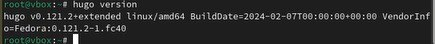

---
## Front matter
lang: ru-RU
title: Отчёт по первому этапу итогового проекта
subtitle: Операционные системы
author:
  - Кудинец М. А.
institute:
  - Российский университет дружбы народов, Москва, Россия
  
## i18n babel
babel-lang: russian
babel-otherlangs: english

## Formatting pdf
toc: false
toc-title: Содержание
slide_level: 2
aspectratio: 169
section-titles: true
theme: metropolis
header-includes:
 - \metroset{progressbar=frametitle,sectionpage=progressbar,numbering=fraction}
---

# Информация

## Докладчик

:::::::::::::: {.columns align=center}
::: {.column width="70%"}

 * Кудинец Максим Антонович
  * НКАбд-02-2024 № Студенческого билета: 1132246729
  * Российский университет дружбы народов
  * <https://github.com/MaKudinets/study_2024-2025_os-intro>

:::
::: {.column width="30%"}

:::
::::::::::::::

# Цель работы

Размещение на Github pages заготовки для персонального сайта.

# Задание

1. Установить необходимое программное обеспечение.
2. Скачать шаблон темы сайта.
3. Разместить его на хостинге git.
4. Установить параметр для URLs сайта.
5. Разместить заготовку сайта на Github pages.

# Выполнение лабораторной работы

1. Переходим в режим суперпользователя и устанавливаем go hugo. 

{#fig:001 width=70%}

##

2. Проверяем версию hugo, если версия слишком низкая, устанавливаем новейшую.

{#fig:002 width=70%}

##

3. Создаем репозиторий на github. 

{#fig:003 width=70%}

##

4. Скачиваем пакеты данных.

{#fig:004 width=70%}

##

5. Через mc находим папку public в необходимом каталоге и удаляем ее.

{#fig:005 width=70%}

##

6. Создаем новый репозиторий, клонируем его и проверяем, на какой ветке мы сейчас находимся. 

{#fig:006 width=70%}

##

{#fig:007 width=70%}

##

7. Делаем коммит в этот репозиторий.

{#fig:008 width=70%}

##

8. Добавляем подраздел в ветку main.

{#fig:009 width=70%}

##

9. Делаем коммит подраздела на репозиторий.

{#fig:010 width=70%}

##

10. Проверяем наличие выложенных файлов на репозитории.

{#fig:011 width=70%}

# Выводы

Разместил на Github pages заготовки для персонального сайта.
