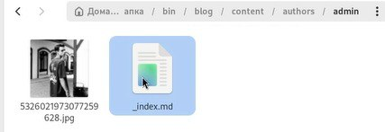
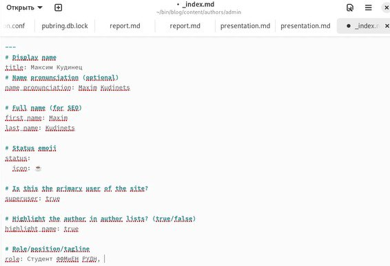
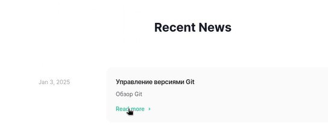
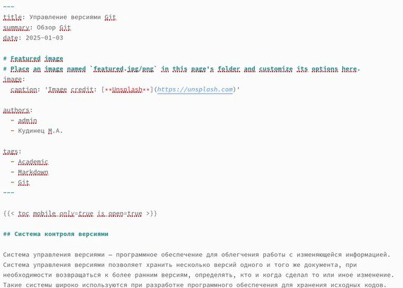
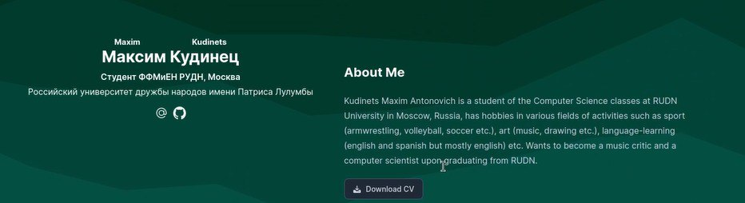
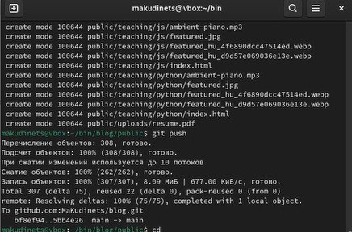

---
## Front matter
lang: ru-RU
title: Отчёт по второму этапу итогового проекта
subtitle: Операционные системы
author:
  - Кудинец М. А.
institute:
  - Российский университет дружбы народов, Москва, Россия

## i18n babel
babel-lang: russian
babel-otherlangs: english

## Formatting pdf
toc: false
toc-title: Содержание
slide_level: 2
aspectratio: 169
section-titles: true
theme: metropolis
header-includes:
 - \metroset{progressbar=frametitle,sectionpage=progressbar,numbering=fraction}
---

# Информация

## Докладчик

:::::::::::::: {.columns align=center}
::: {.column width="70%"}

 * Кудинец Максим Антонович
  * НКАбд-02-2024 № Студенческого билета: 1132246729
  * Российский университет дружбы народов
  * <https://github.com/MaKudinets/study_2024-2025_os-intro>

:::
::: {.column width="30%"}

:::
::::::::::::::

# Цель работы

Добавить к созданному на первом этапе сайту данные о себе.

# Задание

1. Разместить фотографию владельца сайта.
2. Разместить краткое описание владельца сайта (Biography).
3. Добавить информацию об интересах (Interests).
4. Добавить информацию от образовании (Education).
5. Сделать пост по прошедшей неделе.
6. Добавить пост на тему: Управление версиями. Git.

# Выполнение лабораторной работы

1. Заходим в каталог admin и добавляем свою аватарку на сайт.

{#fig:001 width=70%}

##

2. Заполняем файл своей личной информацией. 

{#fig:002 width=70%}

##

3. Обновляем личную информацию на сайте. 

{#fig:003 width=70%}

##

4. Заполняем файл для первого поста на сайте. 

{#fig:004 width=70%}

##

5. Выкладываем первый пост на сайт. 

{#fig:005 width=70%}

##

6. Делаем пост о прошедшей неделе и выкладываем на сайт. 

{#fig:006 width=70%}

##

7. Выкладываем все в локальный репозиторий. 

{#fig:007 width=70%}

##

# Выводы

Добавил к созданному на первом этапе сайту данные о себе.
