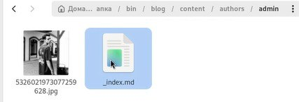
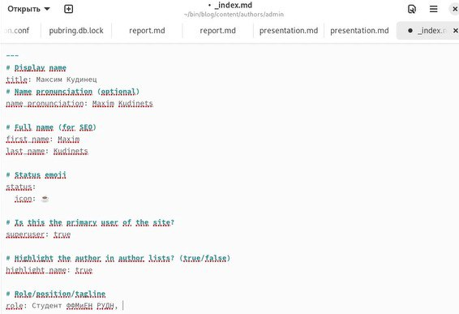
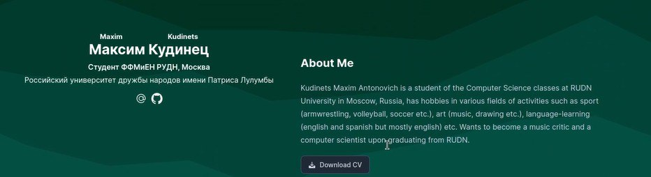
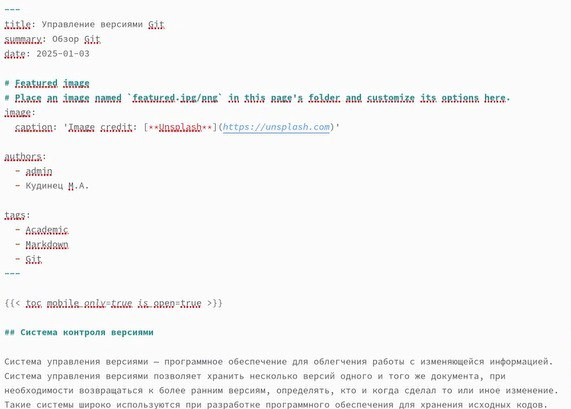
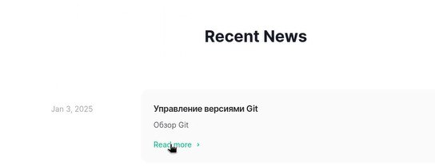
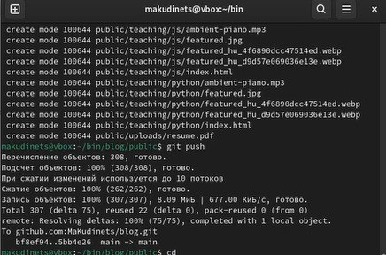

---
## Front matter
title: "Отчёт по второму этапу итогового проекта"
subtitle: "Специальность: архитектура компьютеров"
author: "Кудинец Максим Антонович"

## Generic otions
lang: ru-RU
toc-title: "Содержание"

## Bibliography
bibliography: bib/cite.bib
csl: pandoc/csl/gost-r-7-0-5-2008-numeric.csl

## Pdf output format
toc: true # Table of contents
toc-depth: 2
lof: true # List of figures
lot: true # List of tables
fontsize: 12pt
linestretch: 1.5
papersize: a4
documentclass: scrreprt
## I18n polyglossia
polyglossia-lang:
  name: russian
  options:
	- spelling=modern
	- babelshorthands=true
polyglossia-otherlangs:
  name: english
## I18n babel
babel-lang: russian
babel-otherlangs: english
## Fonts
mainfont: IBM Plex Serif
romanfont: IBM Plex Serif
sansfont: IBM Plex Sans
monofont: IBM Plex Mono
mathfont: STIX Two Math
mainfontoptions: Ligatures=Common,Ligatures=TeX,Scale=0.94
romanfontoptions: Ligatures=Common,Ligatures=TeX,Scale=0.94
sansfontoptions: Ligatures=Common,Ligatures=TeX,Scale=MatchLowercase,Scale=0.94
monofontoptions: Scale=MatchLowercase,Scale=0.94,FakeStretch=0.9
mathfontoptions:
## Biblatex
biblatex: true
biblio-style: "gost-numeric"
biblatexoptions:
  - parentracker=true
  - backend=biber
  - hyperref=auto
  - language=auto
  - autolang=other*
  - citestyle=gost-numeric
## Pandoc-crossref LaTeX customization
figureTitle: "Рис."
tableTitle: "Таблица"
listingTitle: "Листинг"
lofTitle: "Список иллюстраций"
lotTitle: "Список таблиц"
lolTitle: "Листинги"
## Misc options
indent: true
header-includes:
  - \usepackage{indentfirst}
  - \usepackage{float} # keep figures where there are in the text
  - \floatplacement{figure}{H} # keep figures where there are in the text
---

# Цель работы

Добавить к созданному на первом этапе сайту данные о себе.

# Задание

1. Разместить фотографию владельца сайта.
2. Разместить краткое описание владельца сайта (Biography).
3. Добавить информацию об интересах (Interests).
4. Добавить информацию от образовании (Education).
5. Сделать пост по прошедшей неделе.
6. Добавить пост на тему: Управление версиями. Git.

# Выполнение лабораторной работы

1. Заходим в каталог admin и добавляем свою аватарку на сайт. (рис. [-@fig:001]).

{#fig:001 width=70%}

2. Заполняем файл своей личной информацией. (рис. [-@fig:002]).

{#fig:002 width=70%}

3. Обновляем личную информацию на сайте. (рис. [-@fig:003]).

{#fig:003 width=70%}

4. Заполняем файл для первого поста на сайте. (рис. [-@fig:004]).

{#fig:004 width=70%}

5. Выкладываем первый пост на сайт. (рис. [-@fig:005]).

{#fig:005 width=70%}

6. Делаем пост о прошедшей неделе и выкладываем на сайт. (рис. [-@fig:006]).

{#fig:006 width=70%}

7. Выкладываем все в локальный репозиторий. (рис. [-@fig:007]).

{#fig:007 width=70%}

# Выводы

Добавил к созданному на первом этапе сайту данные о себе.

# Список литературы{.unnumbered}

::: {#refs}
:::
