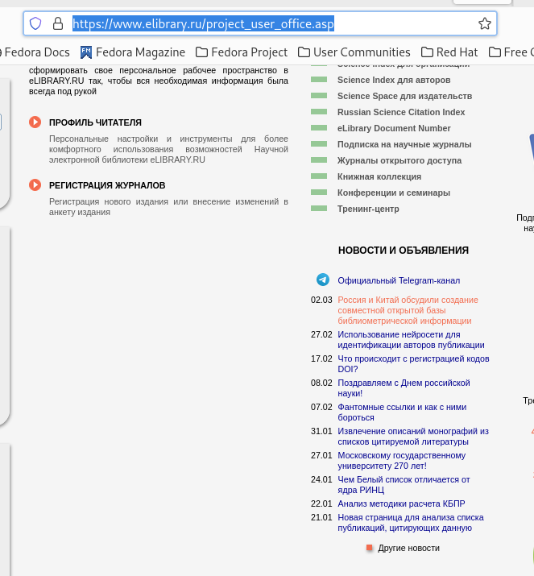
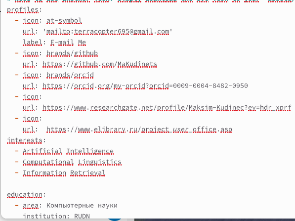
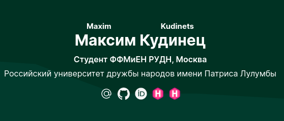
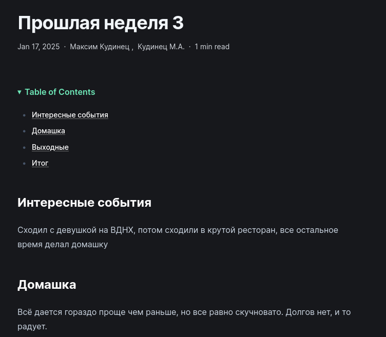
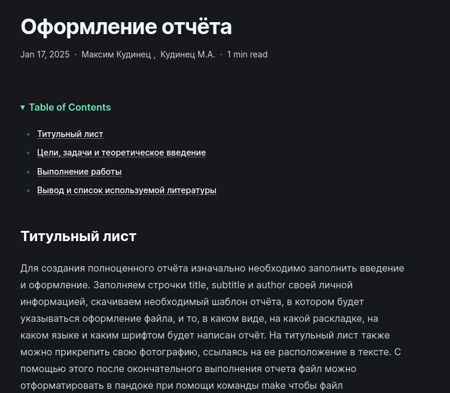

---
## Front matter
lang: ru-RU
title: Отчёт по четвёртому этапу итогового проекта
subtitle: Операционные системы
author:
  - Кудинец М. А.
institute:
  - Российский университет дружбы народов, Москва, Россия

## i18n babel
babel-lang: russian
babel-otherlangs: english

## Formatting pdf
toc: false
toc-title: Содержание
slide_level: 2
aspectratio: 169
section-titles: true
theme: metropolis
header-includes:
 - \metroset{progressbar=frametitle,sectionpage=progressbar,numbering=fraction}
---

# Информация

## Докладчик

:::::::::::::: {.columns align=center}
::: {.column width="70%"}

 * Кудинец Максим Антонович
  * НКАбд-02-2024 № Студенческого билета: 1132246729
  * Российский университет дружбы народов
  * <https://github.com/MaKudinets/study_2024-2025_os-intro>

:::
::: {.column width="30%"}

:::
::::::::::::::

# Цель работы

Добавить к сайту ссылки на научные и библиометрические ресурсы.

# Задание

1. Зарегистрироваться на соответствующих ресурсах и разместить на них ссылки на сайте
2. Сделать пост по прошедшей неделе.
3. Добавить пост на тему: Оформление отчёта.

# Выполнение лабораторной работы

1. Регистрируемся на необходимых сайтах.

{#fig:001 width=70%}

##

2. Забиваем ссылки в файл с информацией о себе.

{#fig:002 width=70%}

##

3. Обновляем информацию о себе на сайте.

{#fig:003 width=70%}

##

4.Создаем пост о прошлой неделе и выкладываем его на сайт.

{#fig:004 width=70%}

##

5. Создаем пост на выбранную тему и выкладываем его на сайт.

{#fig:005 width=70%}

# Выводы

Добавил к сайту ссылки на научные и библиометрические ресурсы.

:::
