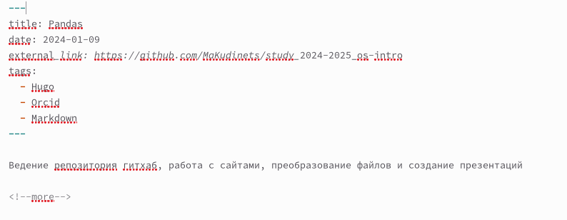
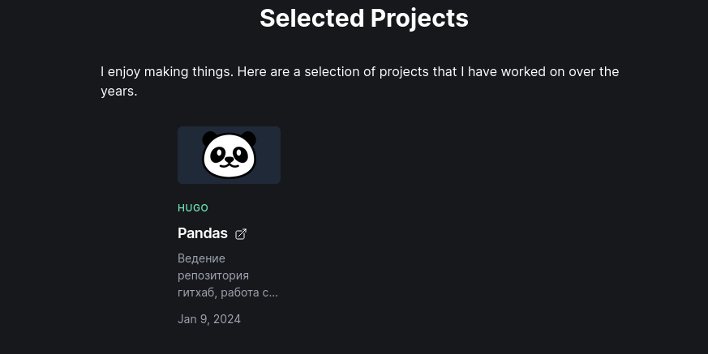
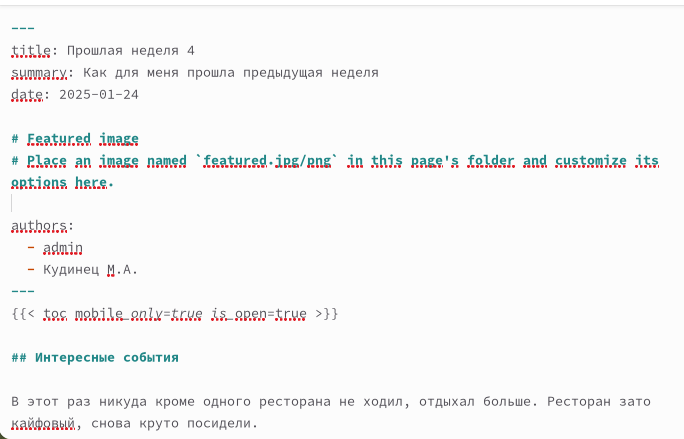
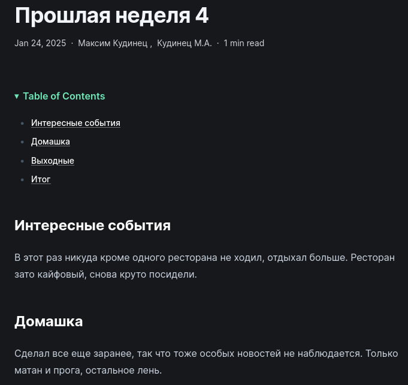
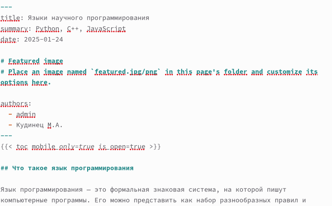
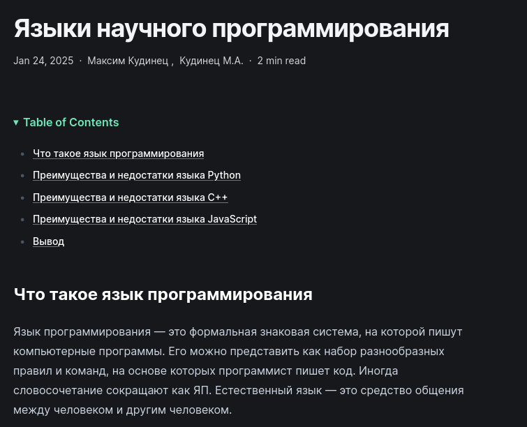

---
## Front matter
lang: ru-RU
title: Отчёт по пятому этапу итогового проекта
subtitle: Операционные системы
author:
  - Кудинец М. А.
institute:
  - Российский университет дружбы народов, Москва, Россия

## i18n babel
babel-lang: russian
babel-otherlangs: english

## Formatting pdf
toc: false
toc-title: Содержание
slide_level: 2
aspectratio: 169
section-titles: true
theme: metropolis
header-includes:
 - \metroset{progressbar=frametitle,sectionpage=progressbar,numbering=fraction}
---

# Информация

## Докладчик

:::::::::::::: {.columns align=center}
::: {.column width="70%"}

 * Кудинец Максим Антонович
  * НКАбд-02-2024 № Студенческого билета: 1132246729
  * Российский университет дружбы народов
  * <https://github.com/MaKudinets/study_2024-2025_os-intro>

:::
::: {.column width="30%"}

:::
::::::::::::::

# Цель работы

Добавить с сайту все остальные элементы.

# Задание

1. Сделать записи для персональных проектов.
2. Сделать пост по прошедшей неделе.
3. Добавить пост на тему: Языки научного программирования.

# Теоретическое введение

# Выполнение лабораторной работы

1. Оформляем файл с записями для персональных проектов, удаляем лищние файлы при необходимости.

{#fig:001 width=70%}

##
\
2. Делаем изменения на сервере. 

{#fig:002 width=70%}

##

3. Делаем пост о прошедшей неделе. 

{#fig:003 width=70%}

##

4. Выкладываем на сайт. 

{#fig:004 width=70%}

##

5. Делаем пост на тему по выбору. 

{#fig:005 width=70%}

##

6. Выкладываем на сайт. 

{#fig:006 width=70%}

# Выводы

Добавил к сайту необходимые изменения, настроил вкладку с проектами.
